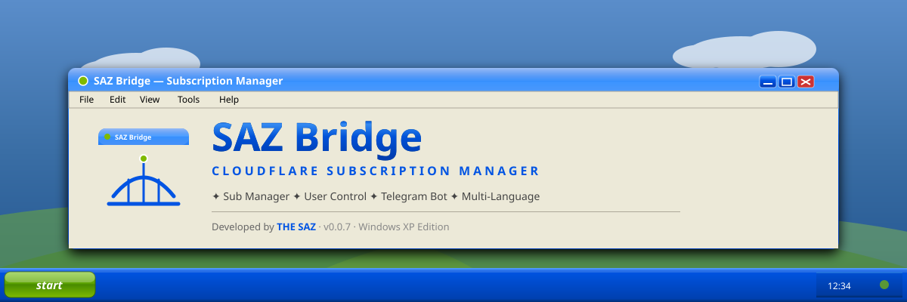
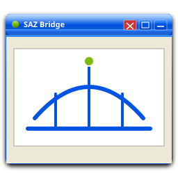

<div align="center">



<br/>
<br/>

# 🌉 SAZ Bridge

### The Ultimate Cloudflare Worker Subscription Manager

**با تم واقعی Windows XP، پشتیبانی از ۴ زبان، Sub Manager حرفه‌ای، و ربات تلگرام**

<br/>

[](https://github.com/THE-SAZ/saz-bridge)
[](https://workers.cloudflare.com)
[](./LICENSE)
[](#-زبان‌ها)
[](https://github.com/THE-SAZ)

<br/>

**[🇮🇷 فارسی](#-فارسی)** · **[🇬🇧 English](#-english)** · **[🇷🇺 Русский](#-русский)** · **[🇨🇳 中文](#-中文)**

<br/>


**Developed with ❤️ by [THE SAZ](https://github.com/THE-SAZ)**

<br/>

</div>

---

## 📋 فهرست مطالب

- [🎯 چرا SAZ Bridge؟](#-چرا-saz-bridge)
- [✨ ویژگی‌های کلیدی](#-ویژگی‌های-کلیدی)
- [🎨 تم Windows XP](#-تم-windows-xp)
- [🌍 زبان‌ها](#-زبان‌ها)
- [🚀 نصب و راه‌اندازی](#-نصب-و-راه‌اندازی)
- [🖥️ اسکرین‌شات‌ها](#️-اسکرین‌شات‌ها)
- [🔧 معماری](#-معماری)
- [📡 API](#-api)
- [🤖 ربات تلگرام](#-ربات-تلگرام)
- [🔐 امنیت](#-امنیت)
- [❓ سوالات متداول](#-سوالات-متداول)
- [🤝 مشارکت](#-مشارکت)
- [📜 مجوز](#-مجوز)
- [👨‍💻 توسعه‌دهنده](#-توسعه‌دهنده)

---

## 🎯 چرا SAZ Bridge؟

**SAZ Bridge** یک پنل مدیریت ساب‌لینک مدرن و قدرتمند است که بر بستر **Cloudflare Workers** اجرا می‌شود. این پنل به شما این امکان را می‌دهد که:

- 🔗 **ساب‌لینک‌های Base64** بسازید که در تمام کلاینت‌های معروف کار می‌کنند
- 👥 **کاربران** خود را با حجم، انقضا و گروه مدیریت کنید
- 📦 **گروه‌بندی** کاربران و ساب‌لینک‌ها برای سازماندهی بهتر
- 🤖 **ربات تلگرام** را یکپارچه کنید تا کاربران خود ساب بگیرند
- 🌐 **پنل را به ۴ زبان** فارسی، انگلیسی، روسی و چینی نمایش دهید
- 🎨 از **تم واقعی Windows XP** لذت ببرید

> 💡 **چرا Cloudflare Worker؟** چون رایگان، سریع، بدون سرور و در سراسر جهان توزیع شده است. نیاز به VPS، پنل هاست یا هر چیز دیگری ندارید.

---

## ✨ ویژگی‌های کلیدی

<table>
<tr>
<td width="50%" valign="top">

### 🎨 رابط کاربری
- ✅ **تم واقعی Windows XP Luna** با پنجره‌های گرادیانی
- ✅ **حس واقعی XP**: نوار عنوان آبی، دکمه‌های Minimize/Maximize/Close
- ✅ **Taskbar و Start Menu** شبیه‌سازی‌شده
- ✅ **۳ تم جایگزین**: Luna Blue، Classic، Silver
- ✅ **کاملاً واکنش‌گرا** (Desktop، Tablet، Mobile)
- ✅ **RTL + LTR** به‌صورت خودکار
- ✅ **بدون لگ و باگ** با بهینه‌سازی v0.0.7

</td>
<td width="50%" valign="top">

### ⚡ امکانات اصلی
- ✅ **مدیریت کاربران** با CRUD کامل
- ✅ **Sub Manager** با نام، گروه، پیشوند، منابع چندگانه
- ✅ **گروه‌بندی** کاربران و ساب‌ها
- ✅ **QR Code** خودکار برای هر ساب
- ✅ **جستجو و فیلتر** پیشرفته
- ✅ **مرتب‌سازی** بر اساس حجم، تاریخ، نام
- ✅ **Bulk Operations** (فعال/غیرفعال گروهی)

</td>
</tr>
<tr>
<td valign="top">

### 🔗 ساب‌لینک
- ✅ فرمت استاندارد **Base64**
- ✅ سازگار با **V2RayNG, NekoBox, V2Box, Shadowrocket, Clash, Mihomo, v2rayN, sing-box**
- ✅ هدر **Subscription-Userinfo** برای نمایش مصرف
- ✅ تشخیص خودکار **User-Agent** (Clash → YAML)
- ✅ **پروفایل QR** برای اسکن سریع

</td>
<td valign="top">

### 🤖 ربات تلگرام
- ✅ Webhook خودکار در پنل
- ✅ دستورات `/start`، `/mysub`، `/usage`، `/help`
- ✅ دکمه‌های Inline شیک
- ✅ اطلاع‌رسانی انقضا
- ✅ اتصال خودکار Chat ID به کاربر

</td>
</tr>
<tr>
<td valign="top">

### 🌍 چندزبانه (i18n)
- ✅ **فارسی** (RTL) — `fa`
- ✅ **انگلیسی** — `en`
- ✅ **روسی** — `ru`
- ✅ **چینی ساده** — `zh`
- ✅ تشخیص خودکار زبان مرورگر
- ✅ ذخیره‌سازی در Cookie

</td>
<td valign="top">

### 🛠️ ابزارهای مدیریتی
- ✅ **Setup Wizard** در اولین اجرا
- ✅ **بدون نیاز به Secrets** — همه در KV
- ✅ **Backup/Restore** با JSON
- ✅ **Import از URL**
- ✅ **لاگ بازدیدها** هر ساب
- ✅ **آمار پیشرفته** و نمودارها

</td>
</tr>
</table>

---

## 🎨 تم Windows XP

پنل SAZ Bridge v0.0.7 طراحی خود را دقیقاً از **Windows XP Luna Theme** الهام گرفته است:

| عنصر | توضیح |
|------|-------|
| 🔵 **نوار عنوان** | گرادیان آبی واقعی XP (`#0058E6` → `#003DB8`) |
| 🟢 **Start Button** | سبز درخشان با آیکون ویندوز |
| 🔘 **پنجره‌ها** | گوشه‌های گرد، سایه، Border آبی |
| 📁 **Panelها** | با هدر گرادیان آبی/سفید |
| 🎛️ **دکمه‌ها** | 3D با Hover طلایی |
| 📊 **جدول‌ها** | سرصفحه خاکستری، خطوط قرمز/خاکستری |
| 📝 **فیلدها** | Border `#7F9DB9` و Focus آبی |
| 🔊 **Taskbar** | در پایین صفحه با ساعت و System Tray |

### انتخاب تم
از **Start Menu → Settings → Theme** می‌توانید بین:
- 🔵 **Luna Blue** (پیش‌فرض)
- ⚪ **Windows Classic** (خاکستری)
- 🟣 **Luna Silver** (نقره‌ای)

انتخاب کنید.

---

## 🌍 زبان‌ها

SAZ Bridge در ۴ زبان کامل ترجمه شده است:

| زبان | کد | جهت | پیش‌فرض |
|------|----|----|--------|
| 🇮🇷 فارسی | `fa` | RTL | ✅ |
| 🇬🇧 English | `en` | LTR | |
| 🇷🇺 Русский | `ru` | LTR | |
| 🇨🇳 中文 | `zh` | LTR | |

### تغییر زبان
- از **Start Menu → Settings → Language**
- یا کلیک روی پرچم در Taskbar
- یا Cookie `lang=xx` در مرورگر

---

## 🚀 نصب و راه‌اندازی

### پیش‌نیازها
- حساب [Cloudflare](https://dash.cloudflare.com) (رایگان)
- Node.js 18+ و npm
- حساب [GitHub](https://github.com) (اختیاری — برای Fork)

### ۱) کلون کردن
```bash
git clone https://github.com/THE-SAZ/saz-bridge.git
cd saz-bridge
npm install
```

### ۲) ساخت KV Namespace
```bash
npx wrangler kv:namespace create "SUB_KV"
npx wrangler kv:namespace create "SUB_KV" --preview
```

خروجی را در `wrangler.toml` جای‌گذاری کنید:
```toml
[[kv_namespaces]]
binding = "SUB_KV"
id = "abc123..."
preview_id = "def456..."
```

### ۳) Deploy
```bash
npx wrangler deploy
```

### ۴) Setup Wizard
اولین باری که آدرس Worker را باز می‌کنید، **Setup Wizard** ظاهر می‌شود:

1. 🔑 رمز عبور مدیر را تعیین کنید
2. 🛣️ مسیر ساب‌لینک را انتخاب کنید (پیش‌فرض: `sub`)
3. 🌐 زبان پیش‌فرض را انتخاب کنید
4. 🎨 تم را انتخاب کنید
5. 🤖 (اختیاری) توکن ربات تلگرام

همه چیز در KV ذخیره می‌شود — **نیازی به ویرایش کد یا Secret نیست**.

### ۵) ورود به پنل
با رمزی که تعیین کردید وارد شوید. خوش آمدید! 🎉

---

## 🖥️ اسکرین‌شات‌ها

> 📸 به‌زودی اسکرین‌شات‌های واقعی اضافه می‌شوند.

```
┌────────────────────────────────────────────────────────────┐
│  🔵 SAZ Bridge — Subscription Manager      [_] [□] [✕]    │
├────────────────────────────────────────────────────────────┤
│  File   Edit   View   Tools   Help                        │
├────────────────────────────────────────────────────────────┤
│  [🏠 Home] [👥 Users] [🔗 Subs] [📁 Groups] [🤖 Bot]      │
├────────────────────────────────────────────────────────────┤
│                                                            │
│   👥 24 Users   ✅ 18 Active   📊 42 GB   🔗 8 Subs       │
│                                                            │
│   ┌──────────────────────────────────────────┐            │
│   │ Name         Status    Usage    Expiry   │            │
│   │ Ali          ✅ Active 12/50GB  30 days  │            │
│   │ Sara         ✅ Active 5/50GB   45 days  │            │
│   │ Reza         ⚠️ Expired 50/50GB 0 days   │            │
│   └──────────────────────────────────────────┘            │
│                                                            │
├────────────────────────────────────────────────────────────┤
│  Ready                                    Connected 🔵    │
└────────────────────────────────────────────────────────────┘
```

---

## 🔧 معماری

```
┌─────────────────────────────────────────────────────────────┐
│                    Cloudflare Worker                        │
│                    (saz-bridge.workers.dev)                 │
├─────────────────────────────────────────────────────────────┤
│                                                             │
│  Routes:                                                    │
│  ┌──────────────────────────────────────────────────────┐  │
│  │  GET  /              → Login / Redirect              │  │
│  │  POST /login         → Authenticate                  │  │
│  │  GET  /setup        → Setup Wizard                   │  │
│  │  POST /setup        → Save config                    │  │
│  │  GET  /admin        → Dashboard                      │  │
│  │  GET  /logout       → Destroy session                │  │
│  │                                                       │  │
│  │  GET  /api/config   → Get config                     │  │
│  │  POST /api/config   → Update config                  │  │
│  │  GET  /api/users    → List users                     │  │
│  │  POST /api/user     → Create user                    │  │
│  │  PUT  /api/user/:t  → Update user                    │  │
│  │  DEL  /api/user/:t  → Delete user                    │  │
│  │  POST /api/sub      → Create sub                     │  │
│  │  PUT  /api/sub/:id  → Update sub                     │  │
│  │  DEL  /api/sub/:id  → Delete sub                     │  │
│  │  POST /api/group    → Create group                   │  │
│  │  DEL  /api/group/:i → Delete group                   │  │
│  │  POST /api/bot/set-webhook                           │  │
│  │  POST /api/backup   → Export JSON                    │  │
│  │  POST /api/restore  → Import JSON                    │  │
│  │                                                       │  │
│  │  GET  /{subPath}/:token → Base64 Subscription       │  │
│  │  POST /tg-webhook   → Telegram Updates               │  │
│  └──────────────────────────────────────────────────────┘  │
│                                                             │
├─────────────────────────────────────────────────────────────┤
│                                                             │
│  Storage (KV Namespace: SUB_KV):                            │
│  ┌─────────────┬─────────────┬─────────────┬─────────────┐ │
│  │  config     │   users     │   groups    │  sub_links  │ │
│  │  session:*  │  logs:*     │  bot:*      │   stats     │ │
│  └─────────────┴─────────────┴─────────────┴─────────────┘ │
│                                                             │
└─────────────────────────────────────────────────────────────┘
                             │
                             │ HTTPS
                             ▼
        ┌────────────────────────────────────────┐
        │   Clients: V2RayNG, NekoBox, v2rayN,   │
        │   V2Box, Shadowrocket, Clash, ...      │
        └────────────────────────────────────────┘
```

---

## 📡 API

پنل SAZ Bridge یک API کامل دارد که می‌توانید با آن یکپارچه‌سازی کنید. برای جزئیات کامل، فایل [`docs/API.md`](./docs/API.md) را ببینید.

**مثال: دریافت لیست کاربران**
```bash
curl https://your-worker.workers.dev/api/users \
  -H "Cookie: session=YOUR_SESSION_TOKEN"
```

---

## 🤖 ربات تلگرام

### ویژگی‌های ربات
- 📋 `/start` — منوی اصلی با دکمه‌های Inline
- 🔗 `/mysub` — دریافت لینک ساب شخصی
- 📊 `/usage` — نمایش مصرف و انقضا با Progress Bar
- ❓ `/help` — راهنما

### تنظیم ربات
1. در تلگرام به [@BotFather](https://t.me/BotFather) رفته و `/newbot` بزنید
2. توکن دریافتی را کپی کنید
3. در پنل SAZ Bridge → **Start Menu → Settings → Bot**
4. توکن را وارد کرده و روی **Set Webhook** کلیک کنید
5. Chat ID کاربران را در پنل کاربران وارد کنید تا به حسابشان متصل شوند

---

## 🔐 امنیت

- ✅ **Session-based Auth** با TTL 24 ساعته
- ✅ **HTTP-only + Secure + SameSite** Cookies
- ✅ **Constant-time password comparison**
- ✅ **HTTPS اجباری** (Cloudflare)
- ✅ **بدون ذخیره رمز به‌صورت plain text** (در KV فقط hash نگه‌داری می‌شود)
- ✅ **Rate limiting** از طریق Cloudflare Dashboard

### توصیه‌ها
- 🔑 رمز عبور قوی تعیین کنید (حداقل ۱۲ کاراکتر)
- 🛣️ مسیر ساب را تصادفی کنید (مثلاً `x7k9m2p4`)
- 🌐 در صورت امکان دامنه اختصاصی متصل کنید
- 🔒 Cloudflare Access برای `/admin` فعال کنید

---

## ❓ سوالات متداول

<details>
<summary><b>آیا نیاز به VPS دارم؟</b></summary>

**خیر!** کل پنل روی Cloudflare Workers اجرا می‌شود که کاملاً رایگان است. فقط یک حساب Cloudflare لازم دارید.
</details>

<details>
<summary><b>آیا محدودیت ترافیک دارد؟</b></summary>

پلن رایگان Cloudflare Workers شامل **۱۰۰,۰۰۰ درخواست در روز** و KV شامل **۱۰۰,۰۰۰ خواندن + ۱,۰۰۰ نوشتن در روز** است. برای اکثر کاربران کافی است.
</details>

<details>
<summary><b>چطور کاربران به ربات وصل شوند؟</b></summary>

Chat ID هر کاربر را از [@userinfobot](https://t.me/userinfobot) بگیرید و در پنل کاربران در فیلد "Telegram" وارد کنید.
</details>

<details>
<summary><b>آیا از Clash پشتیبانی می‌شود؟</b></summary>

بله. با تشخیص خودکار User-Agent، به Clash/Mihomo محتوا با Content-Type `text/yaml` تحویل داده می‌شود.
</details>

<details>
<summary><b>چطور Backup بگیرم؟</b></summary>

از Start Menu → **Backup** → **Export JSON**. تمام داده‌ها در یک فایل JSON ذخیره می‌شود.
</details>

---

## 🤝 مشارکت

از مشارکت شما استقبال می‌کنیم! 🎉

1. Fork کنید
2. یک Branch جدید بسازید (`git checkout -b feature/amazing-feature`)
3. Commit کنید (`git commit -m 'Add amazing feature'`)
4. Push کنید (`git push origin feature/amazing-feature`)
5. Pull Request باز کنید

---

## 📜 مجوز

این پروژه تحت [MIT License](./LICENSE) منتشر شده است.

---

## 👨‍💻 توسعه‌دهنده

<div align="center">


### **THE SAZ**

**Full-Stack Developer · Cloudflare Enthusiast**

[](https://github.com/THE-SAZ)
[](https://github.com/THE-SAZ/saz-bridge)

</div>

---

<div align="center">

### 🌉 SAZ Bridge — v0.0.7

**Built with ❤️ on Cloudflare Workers**

⭐ اگر مفید بود، ستاره بدهید! ⭐

<br/>



</div>